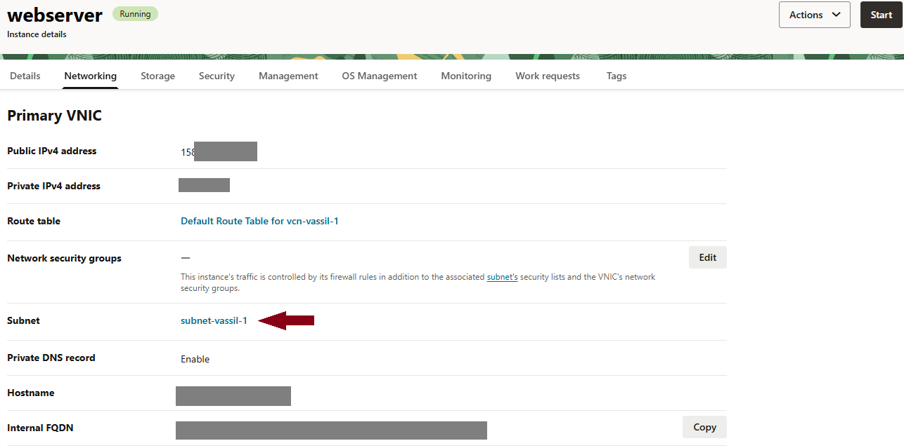
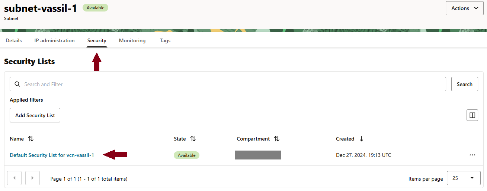
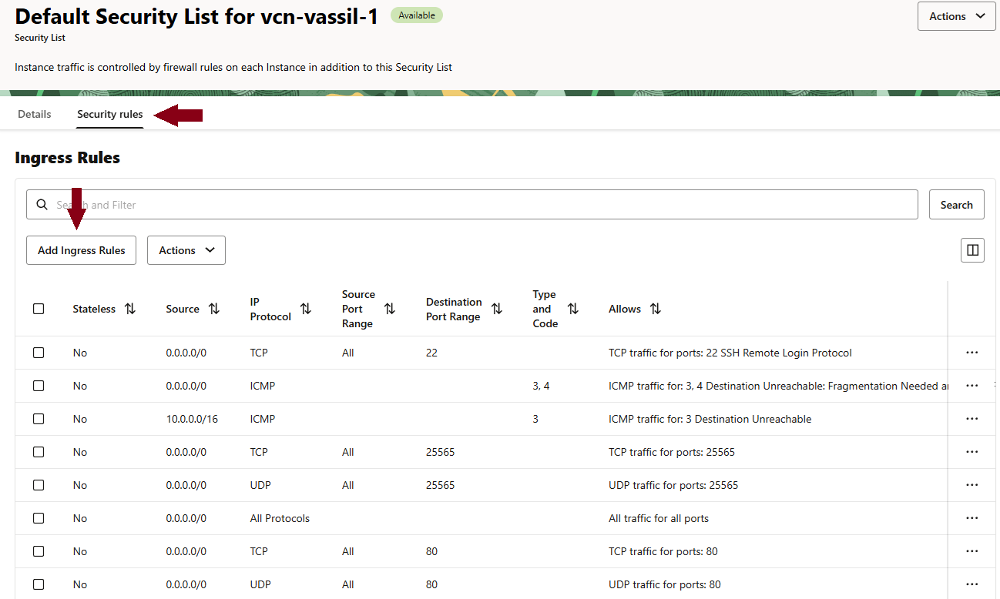

# VM Erstellen

- Basic Information  
     → Name vergeben für die Instanz z.B. webserver  
     → Image: Ubuntu 22.04  
     → Shape: AMD VM.Standard.E2.1.Micro  
- Security  
     → Unberührt lassen
- Networking  
     → Create a new virtual cloud network: Namen vergeben für Cloud Network und für Subnet  
     → SSH Key herunterladen oder bestehenden publickey hochladen  
- Boot Volume  
     → Unberührt lassen  
- Review  
     → Zum Abschließen „Create“ Button drücken und warten bis VM installiert ist  

# SSH Einrichten

Unter Instanzen sollte nun die Instanz mit dem vergebenen Namen auftauchen.
Diese nun auswählen. Unter Details ist nun die Public IP Adresse hinterlegt.
Unter MobaXterm:
```
New Session → SSH
  o Remote host: <PUBLIC_IP_DES_SERVERS>
  o Specify username: ubuntu
  o Advanced SSH settings:
    ➔ Private key aktivieren und Datei auswählen
```

# VM als Webserver einrichten

Nun sollte man sich mit der VM verbunden haben. Danach folgendes eingeben:

- Eingabe für ngnix und php: 
```
sudo su
apt-update
apt install ufw
apt install nginx
apt install php‐fpm
cd /etc/nginx/sites‐available
nano default
```
- Wir sind nun im nano Texteditor und die Datei „default“ wird dargestellt
- Zeile suchen (nach unten scrollen mit Pfeiltasten): #location ~ \.php$ {
- Das # wegmachen (mit der Entfernen-Taste oder backspace) um die zeile zu aktivieren (diese wird dann weiß dargestellt)
- Die folgenden Zeilen müssen „aktiviert“ werden (inkl der Zeile mit der Klammer } ):
```
location ~ \.php$ {
   include snippets/fastcgi‐php.conf;
   fastcgi_pass unix:/run/php/php8.1‐fpm.sock;
}
```
- Die Zeile “fastcgi_pass ...” muss angepasst werden nach dem aktivieren. Mit "php -v" kann die php-Version ermittelt werden. "... with Zend OPcache v8.1.2ubuntu.2.21 ..." Sagt aus, dass es sich um die Version 8.1 handelt.
- Abspeichern mit Taste „Steuerung+X“ dann „Y“ dann „Enter“
- Eingabe für http/https Firewall Genehemigung und Aktivierung:
```
/etc/init.d/nginx reload
sudo ufw allow 80
sudo ufw allow 443
sudo ufw enable
```
- Ändern der Zugriffsrechte im Webserver-Verzeichnis:
```
chown benutzername /var/www/html
chmod a+w /var/www/html
```
- sudo nano /etc/ssh/sshd_config
- Nach Eintrag „PasswordAuthentication yes“ suchen und das # davor entfernen und speichern
- sudo passwd ubuntu → Passwort vergeben für VS Code Login
- Maschine neustarten mit: reboot


# Ingress Rules bearbeiten für externen Zugriff

➔ Oracle Instanz öffnen  
➔ Networking
  
  
  
➔ Subnet öffnen  
➔ Default Security List öffnen  
  
  
  

```
➔ Ingress Rules für Port 80 und 443 hinzufügen (am besten für TCP und UDP)
   o Source Type: CIDR
   o Source CIDR: 0.0.0.0/
   o IP Protocol: TCP (das gleiche auch für UDP)
   o Source Port Range: All
   o Destination Port Range: 80 (bzw. 443)
```

  
  
# VS Code mit Cloud Instanz verbinden

- wie gewohnt links unten blauen Button zur SSH Verbindung klicken
- „Verbindung mit Host herstellen“ bestätigen
- „Neuen SSH-Host hinzufügen“
- ubuntu@<IP_DES_SERVERS> eintragen (Ubuntu ist der Name des Standardusers)
- Aufforderungen bestätigen im Fenster rechts unten
- Passworteingabe des Benutzers ubuntu

# VS Code für wenig Ressourcen einrichten

- Per SSH mit dem webserver verbinden
- File → Preferences → Settings  
→ In der Suchleiste nach „search.followsymlinks“ eintippen  
→ Checkbox deaktivieren


